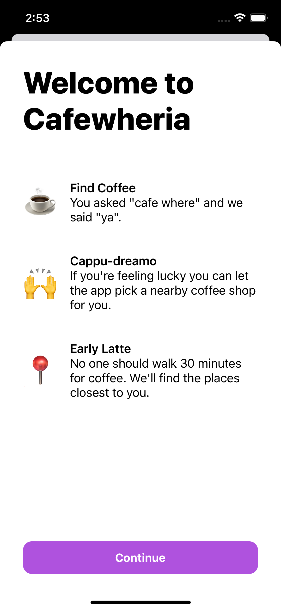
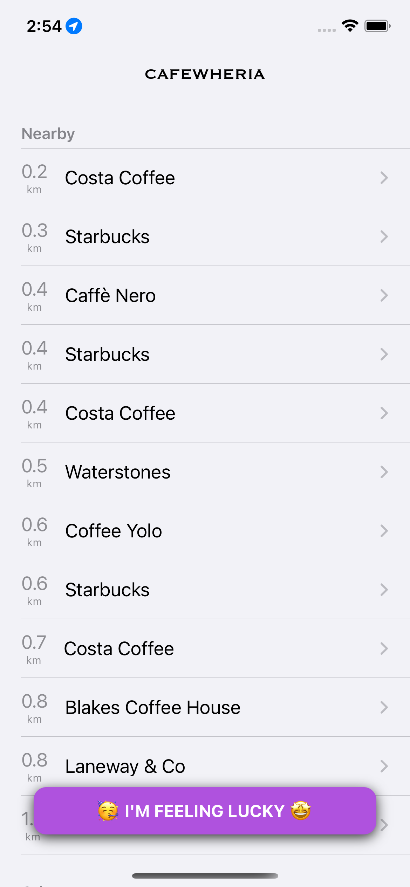
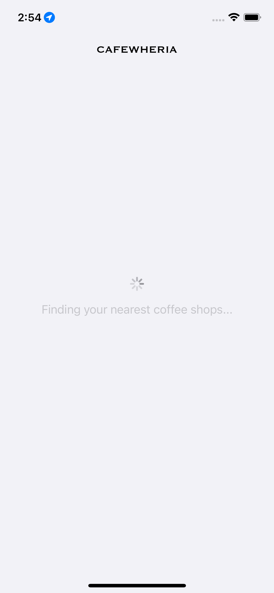
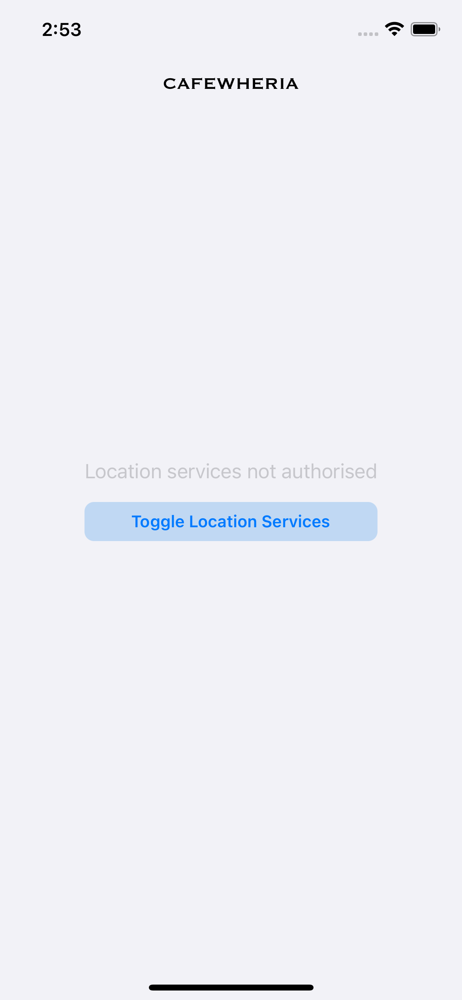
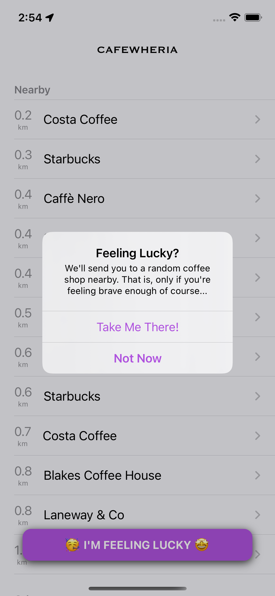
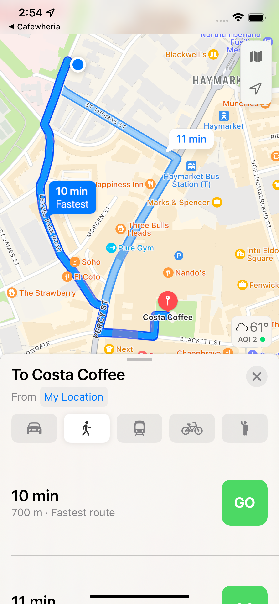

# Cafewheria

An app to find your nearest coffee shop

## Please note:
> To use your own Foursquare keys, head over to Networking/Router.swift

## More Info

Welcome Screen             |  List
:-------------------------:|:-------------------------:
  |  

The app also accommodates for different states such as loading or unauthorised location access.

Loading             |  No Location Access
:-------------------------:|:-------------------------:
  |  

Selecting any coffee shop will open the maps app with walking directions automatically selected. An "I'm Feeling Lucky" button takes adventurous users to a randomly selected nearby location. Only for the brave hearted!

I'm Feeling Lucky             |  Walking Directions in Maps
:-------------------------:|:-------------------------:
  |  
